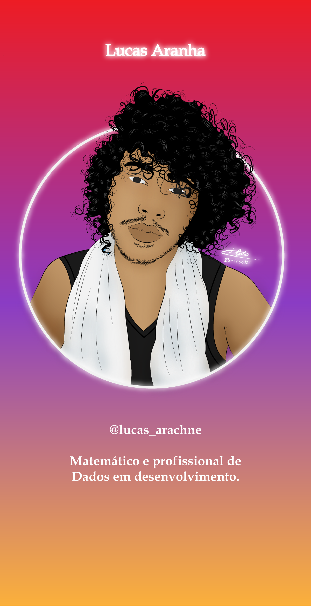
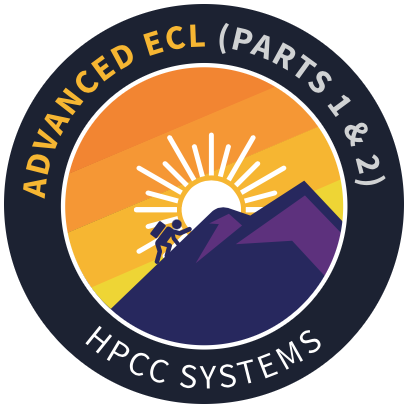
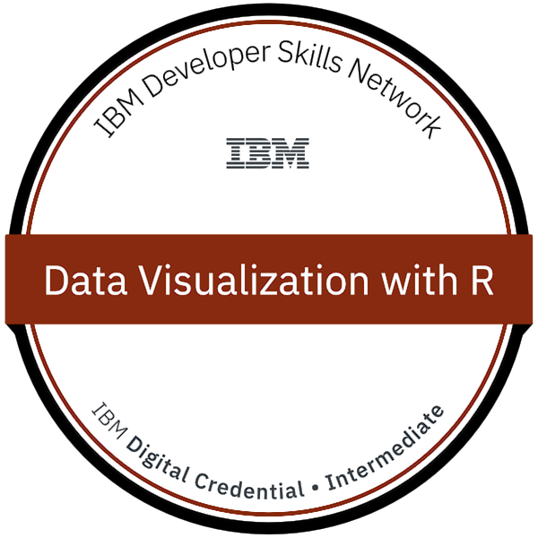

# Eu sou Lucas Aranha, seja bem vindo a minha teia!

<h4 align="left"> 

Um matemático que se rendeu aos encantos do mundo da tecnologia. Atualmente faço parte do Grupo de Estudos em Modelagem Matemática (GEMM) e do Laboratório Experimental de Modelagem Matemática (LEMM). Utilizo a modelagem com ênfase no estudo de doenças infectocontagiosas, especialmente como modelos de séries temporais. Tenho um interesse especial pelas áreas de Epidemioogia, Machine Learning e Análise de Dados.

Uma curiosidade sobre mim: às vezes faço ilustrações digitais. Inclusive a que está no banner logo ao lado eu fiz utilizando o Adobe Illustrator. 

  

<h2 align="left"> 📊 Métricas do Github: </h2>

  

## 🛠️ Algumas linguagens e ferramentas que eu uso:
   

      

  

## Insígnias:
   

   

  

  

<h2 align="left">🔗 Entre em contato comigo:</h2>

