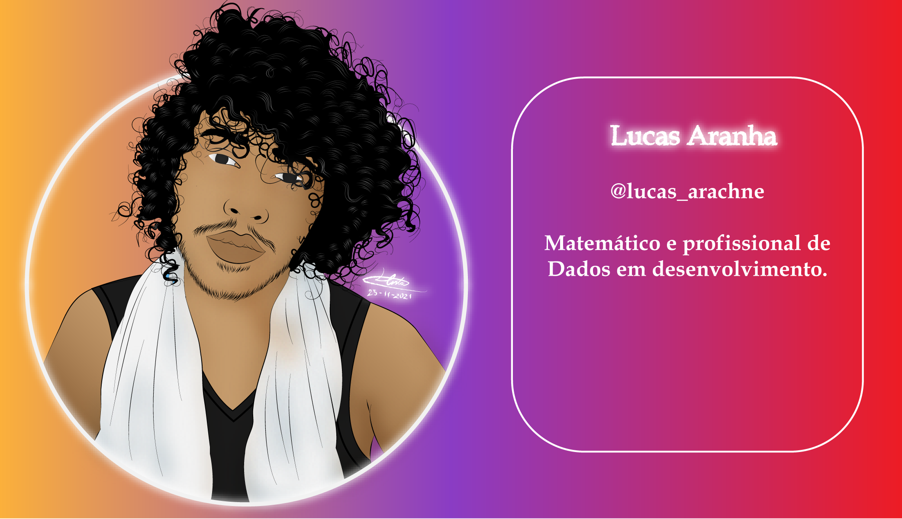
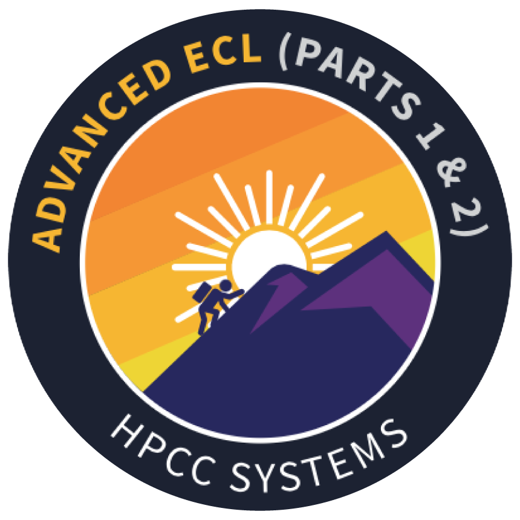

# Eu sou Lucas Aranha, seja bem vindo a minha teia!

<h4 align="justify"> 

#
Um matemático que se rendeu aos encantos do mundo da tecnologia. Atualmente faço parte do Grupo de Estudos em Modelagem Matemática (GEMM) e do Laboratório Experimental de Modelagem Matemática (LEMM). Utilizo a modelagem com ênfase no estudo de doenças infectocontagiosas, especialmente como modelos de séries temporais. Tenho um interesse especial pelas áreas de Epidemioogia, Machine Learning e Análise de Dados. Writer no blog Data Rooters.

  

<h2 align="left"> 📊 Métricas do Github: </h2>
 

  

## 🛠️ Algumas linguagens e ferramentas que eu uso:
   

      

  

## 📕 Vem conferir meus últimos artigos:

- [A dinâmica da dengue em Belém: um projeto end-to-end de Análise de Séries Temporais em Python](https://datarooters.medium.com/b9ca8569ce78)
- [Um pouco da história e curiosidades sobre Python](https://datarooters.medium.com/863a6983c777)

  

## Insígnias:
   

   

  

  

<h2 align="left">🔗 Entre em contato comigo:</h2>

